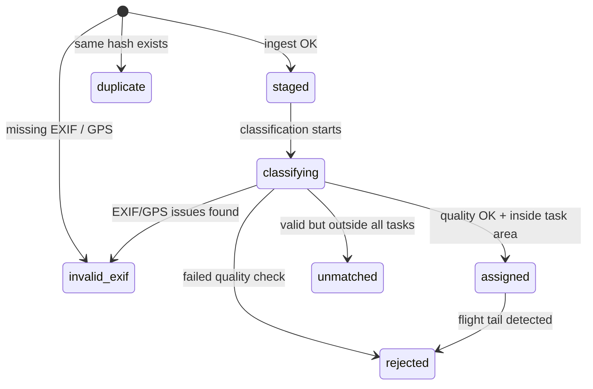
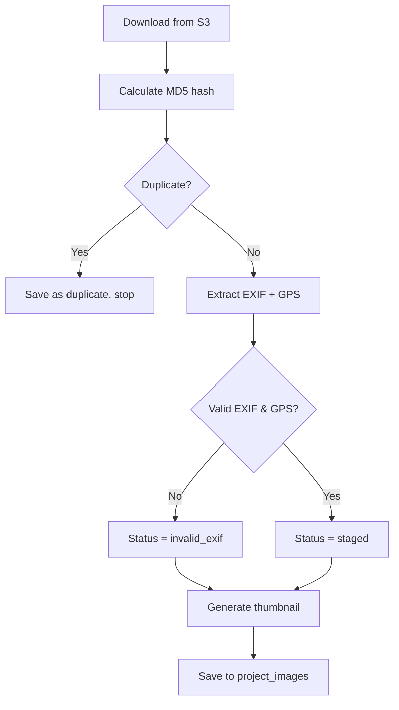
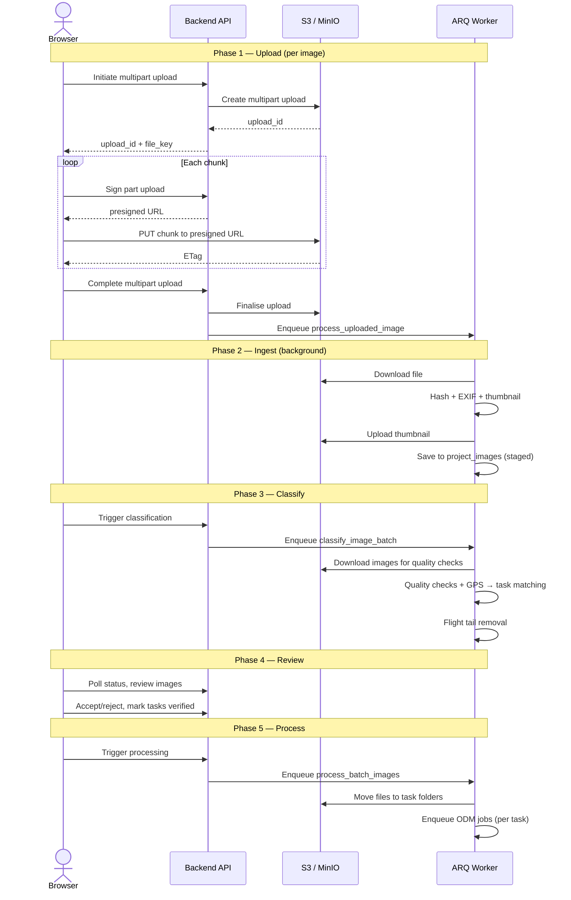

# Imagery Upload Workflow

In late 2025 we worked with a contractor to improve the imagery
upload workflow.

The full discussion and plan can be
[seen here](https://github.com/hotosm/drone-tm/discussions/635).

The workflow is summarised here by Opus 4.6 LLM as of
13/02/2026.

## High-Level Pipeline

| Phase    | Who / What   | Summary                                           |
| -------- | ------------ | ------------------------------------------------- |
| Upload   | Browser → S3 | Resumable multi-part upload direct to S3          |
| Ingest   | ARQ worker   | Hash, EXIF extract, thumbnail, duplicate check    |
| Classify | ARQ worker   | Quality checks, GPS → task matching, tail removal |
| Review   | User (UI)    | Accept/reject images, verify tasks have coverage  |
| Process  | ARQ worker   | Move files to task folders, trigger ODM           |

## Image Statuses

Each image in `project_images` has a status that tracks where it
is in the pipeline:

- **staged** — ingested and waiting for classification.
- **assigned** — passed all checks, matched to a task area.
- **rejected** — failed a quality check (blur, exposure, gimbal, flight tail).
- **unmatched** — valid image but GPS is outside all task boundaries.
- **invalid_exif** — EXIF or GPS data is missing / unreadable.
- **duplicate** — identical MD5 hash already exists in the project.

## Phase 1 — Upload

Images are uploaded from the browser using S3 multi-part resumable
uploads. The backend never proxies file bytes — the browser uploads
chunks directly to S3 via presigned URLs.

**S3 paths:**

- Staging: `projects/{project_id}/user-uploads/{filename}`
- Direct to task: `projects/{project_id}/{task_id}/images/{filename}`

**API flow** (all under `/api/projects/`):

1. `POST /initiate-multipart-upload/` → get `upload_id` + `file_key`
2. `POST /sign-part-upload/` (per chunk) → get presigned URL
3. Browser `PUT`s each chunk directly to S3
4. `POST /complete-multipart-upload/` → finalise in S3, enqueue ingest job
5. `GET /list-parts/` — for resuming interrupted uploads
6. `POST /abort-multipart-upload/` — cancel and clean up

## Phase 2 — Ingest

Each completed upload enqueues a `process_uploaded_image` ARQ job
(deferred 2 s for S3 consistency). Jobs are isolated — one corrupt
image won't affect others.

A `project_images` row is **always** created so the UI can show
every upload attempt and its outcome.

## Phase 3 — Classify

The user triggers classification via
`POST /{project_id}/classify-batch/`, which enqueues a
`classify_image_batch` ARQ job for all `staged` images in the batch.

Images are classified in parallel (up to 6 at a time). Each image
goes through:

1. **EXIF check** — must have metadata.
2. **GPS validation** — valid coordinates in range.
3. **Gimbal pitch** — camera must point down (≤ -20°).
4. **Sharpness** — Laplacian variance must be ≥ 100.
5. **Exposure** — rejects mostly black (lens cap) or mostly white
   (overexposed) images.
6. **Task matching** — GPS point intersected against task polygons.

Images that pass all checks and fall inside a task area are
**assigned**. Others are marked **rejected**, **unmatched**, or
**invalid_exif**.

After classification, **flight tail removal** runs per task to reject
images captured during takeoff/landing transit (detected by analysing
azimuthal shifts in the flight trajectory).

## Phase 4 — Review

The user reviews classified images in the UI:

- View images grouped by task, with thumbnails and status.
- Inspect image locations on a map overlaid with task boundaries.
- Check estimated coverage percentage per task.
- Accept previously rejected images, or delete bad ones.
- **Mark tasks as verified** ("fully flown") — this is required
  before processing can begin.

## Phase 5 — Process

The user triggers processing via
`POST /{project_id}/batch/{batch_id}/process/`, which enqueues a
`process_batch_images` ARQ job.

1. **Move files** — assigned images in verified tasks are copied in S3
   from `user-uploads/` to `{task_id}/images/`.
2. **Trigger ODM** — for each task with ≥ 3 images, a
   `process_drone_images` job is enqueued for photogrammetric
   processing.

## End-to-End Sequence

