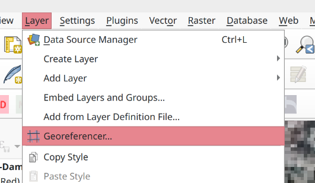
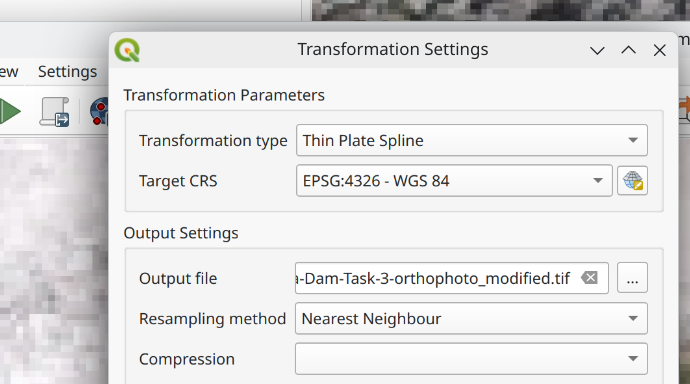
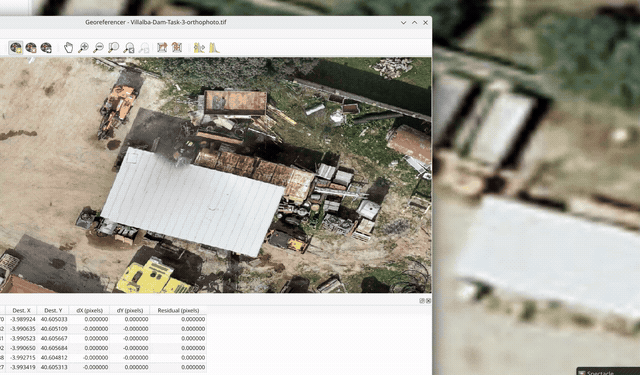
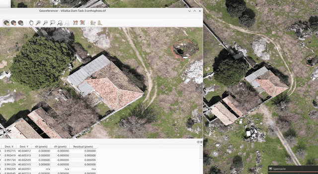

# Correcting or Stitching Orthomosaics Manually

!!! important

    You will generally get better results if you ensure you have
    all raw imagery in advance and pass it into OpenDroneMap.

    This allows for sophisticated stiching of the images together
    using point cloud meshes etc and is more accurate.

    However, in some circumstances this is not possible:

    1. You are running ODM on a machine with limited resources.
    2. The orthomosaics were generated already, but now you
       need to stitch them together and do not have the source
       imagery.

    This process may also be useful to re-align imagery that is
    badly georeferenced in the output from ODM.

    The preferred approach would be including ground control points
    in your flights (although this can be expensive).

    Failing that you may use this process to align the resulting
    imagery with another georeferenced layer, such as Bing/Esri/OSM.

This workflow uses QGIS to georeference each orthomosaic manually,
then merges the corrected TIFFs into a single output.

Credit to Sam Colchester who took the time to work this out and
document for the benefit of other users!

## Requirements

- QGIS.
- QuickMapServices plugin in QGIS.
- QuickMapServices [contributed servuces](https://nextgis.com/blog/quickmapservices-with-contributed-services)
  enabled so Bing and Esri basemaps are available.
- [otbcli_Mosaic](https://www.orfeo-toolbox.org/download) installed
  from Orfeo Toolbox for the merge step.
- `gdalwarp` for optional reprojection and compression.

## 1. Configure QGIS basemaps

Install the QuickMapServices plugin in QGIS.

Then enable the contributed services so you can load Bing and Esri
reference imagery:

1. Open `Web > QuickMapServices > Settings`.
2. Go to the `More services` tab.
3. Click `Get contributed pack`.

After that, add a reference layer such as Bing, Esri, or OSM to help
place control points accurately.

## 2. Open the Georeferencer

In QGIS, open `Layer > Georeferencer`.



## 3. Set the transformation type

In Georeferencer, open `Settings > Transformation settings` and set
the transformation type to `Thin Plate Spline`.

This method is useful when the orthomosaic needs local warping rather
than a simple shift or rotation.



## 4. Georeference the first TIFF

1. Choose `Open Raster` and load one of the orthomosaic TIFF files.
2. Start adding control points against Bing, Esri, or OSM.
3. Use at least 10 control points.
4. Prefer 30 or more when the image covers a large area or shows
   uneven distortion.

Spread the points across the full image rather than clustering them in
one corner.



## 5. Georeference the remaining TIFFs

Once the first TIFF is aligned, georeference the remaining TIFFs:

1. Align them against the already-corrected TIFF anywhere the images
   overlap.
2. Continue using Bing, Esri, or OSM in areas where there is no
   overlap between TIFFs.

This usually gives better continuity across the final mosaic than
matching every TIFF independently against the basemap.



## 6. Merge the corrected TIFFs

Save all resulting TIFFs into a single folder, then open a terminal in
that folder and run:

```bash
tifs_list=$(ls *.tif | tr '\n' ' ')
otbcli_Mosaic -il $tifs_list -out temp_mosaic.tif uint16 -comp.feather large
```

## 7. Optional: reproject to WGS84 and compress

If you want the final output in WGS84 (`EPSG:4326`) with LZW
compression, run:

```bash
gdalwarp -t_srs EPSG:4326 -r cubicspline -co COMPRESS=LZW -co TILED=YES temp_mosaic.tif final_4326.tif
```

## Result

At the end of the process you should have:

- Individually corrected orthomosaic TIFFs
- One merged mosaic
- Optionally, a compressed WGS84 output TIFF

## Notes

- Bing, Esri, and OSM are useful reference layers, but they may still
  contain small positional offsets depending on location.
- The manual georeferencing quality depends heavily on point placement.
  Use stable visible features such as road intersections, building
  corners, bridges, or other clear landmarks.
- If you still have the original drone imagery, OpenDroneMap remains
  the preferred option for producing the best overall mosaic.
- Also, note that using 'Thin Plate Spline' in QGIS may result in visual
  distortion of your imagery, despite it being correctly georeferenced.
