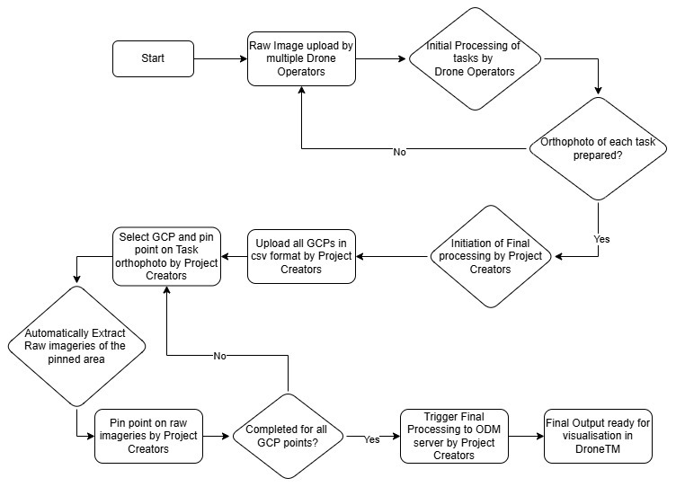

# Ground Control Points

Ground Control Points are simply a way of mapping a known coordinate
in the real world (ideally in very accurate coordinates such as
[ECEF](https://en.wikipedia.org/wiki/Earth-centered,_Earth-fixed_coordinate_system)),
to a pixel on an image for georeferencing.

When multiple GCPs are used together in the final stitching of drone flight
imagery together, the final georeferencing should be very accurate.

Further details can be found on the OpenDroneMap
[docs page about GCPs](https://docs.opendronemap.org/gcp)

## Our Workflow

