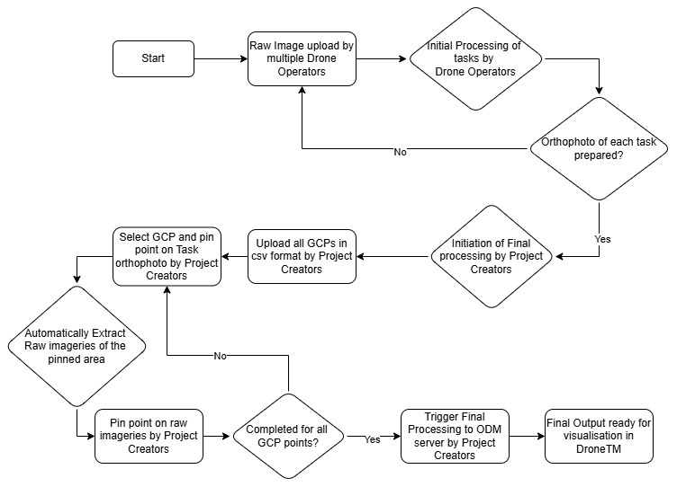

# Ground Control Points

Ground Control Points are simply a way of mapping a known coordinate
in the real world (ideally in very accurate coordinates such as
[ECEF](https://en.wikipedia.org/wiki/Earth-centered,_Earth-fixed_coordinate_system)),
to a pixel on an image for georeferencing.

When multiple GCPs are used together in the final stitching of drone flight
imagery together, the final georeferencing should be very accurate.

Further details can be found on the OpenDroneMap
[docs page about GCPs](https://docs.opendronemap.org/gcp)

## GCP Target Placement

Ground control points are used to ensure high positional accuracy of the final
drone image in case PPK or RTK tools are not available. GCPs are a set of
identifiable features in the collected images with known spatial coordinate
information. GCPs are normally collected with survey-grade GPS devices that
provide centimetre-level precision. These features can be either existing
physical objects (e.g. a corner of a road intersection) or custom targets
manually positioned in advance of a drone survey across the target area of
interest.

Best practices for GCP placement:

- **Distribution:** GCPs should be well distributed across the area of
  interest; otherwise, they could end up skewing the positional accuracy of the
  final images.
- **Visibility:** Targets should be large enough to be seen in multiple (at
  least three) overlapping aerial shots.
- **Anchoring:** Targets should be anchored to the ground so they are not
  accidentally moved by people or wildlife. Depending on the environment, it is
  good practice to include a note next to each target that explains its purpose;
  this should minimise interference from residents.
- **Access:** The manual positioning of custom targets can be very
  time-consuming, as it requires identifying access routes to the areas where
  targets should be placed, then recording each location with an accurate GPS
  device.

### When to use RTK/PPK instead of GCPs

When the timeliness of the data is important, setting up ground control points
to achieve high absolute accuracy may not be cost- or time-effective. In these
situations, a drone equipped with an RTK or PPK system should be used instead.

Real-Time Kinematic (RTK) allows high-precision measurements of locations by
using a base station with known coordinates to send and receive correction data
via a radio link, performing "live" triangulation corrections while the drone is
flying. Post-Processed Kinematic (PPK) is similar to RTK, except that the
corrections to the GPS positions are calculated not during but after the flight.

### When do you need GCPs?

- **Visual / 2D mapping** (OpenAerialMap uploads, OpenStreetMap tracing):
  GPS-only flights are fine. Consumer GPS provides roughly 1-3 m horizontal
  accuracy, which is sufficient for these use cases.
- **DSM / DTM / 3D products, accurate footprints, or cross-task alignment:**
  GCPs (5-8 pre-marked targets distributed across the area of interest,
  surveyed with RTK) or an RTK-capable drone should be standard. GCPs transform
  output accuracy from ~1.5 m horizontal / variable vertical to ~5-10 cm in
  both, and resolve doming and altitude-step artefacts.

> _Adapted from: World Bank and Humanitarian OpenStreetMap Team (2019).
> Technical Guidelines for Small Island Mapping with UAVs.
> CC BY 4.0._

## Our Workflow

