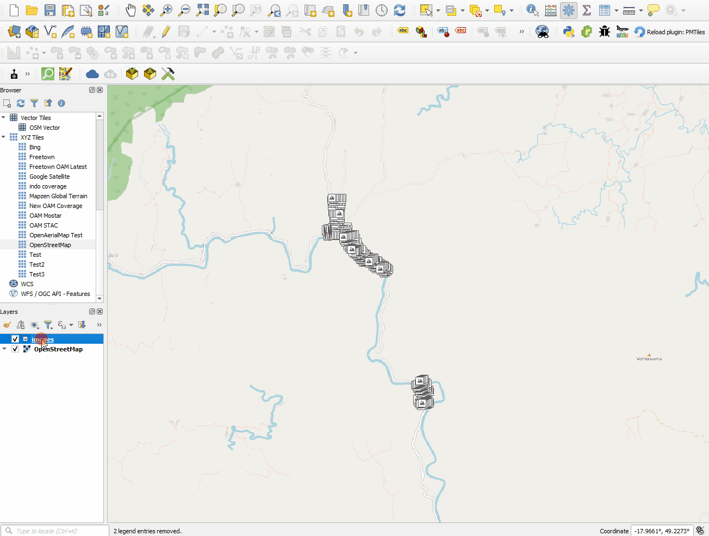
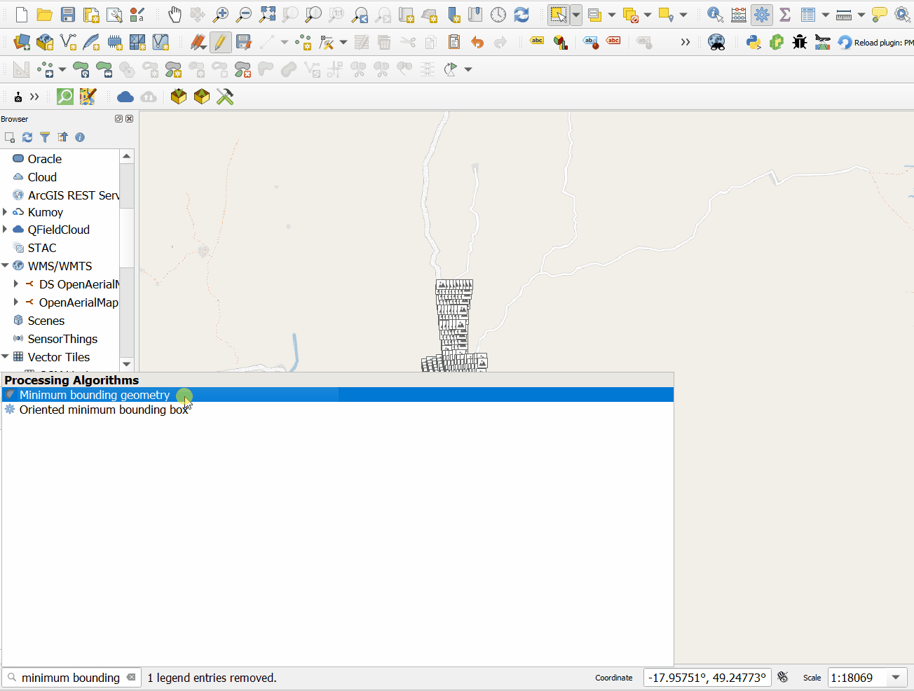

# Processing External Imagery

## Requirements

- QGIS, with plugin [ImportPhotos](https://plugins.qgis.org/plugins/ImportPhotos) installed.
- A directory of imagery you wish to process, captured by a drone.

## Method

### 1. Prep the photos via ImportPhotos

- Click the ImportPhotos plugin icon.
- This will open a dialog where you specify:
  - **Input folder location**: where your photos are located
    (can include subfolders).
  - **Output file location**: this will simply output a
    `.gpkg` file with details of the photos you import.
- Click 'OK' to import the photos and view in QGIS.

!!! note

    Ensure that your dataset is all of a single area, with
    overlapping photos.

    While doing this, I had a folder of photos from two
    different flights. The GIF below demonstrates how
    to separate the files easily using QGIS and ImportPhotos.

### 2. Create a geojson file around the photo locations

Here we create a bounding geometry, buffer slightly by
`0.0005` degrees, and save as a geojson for our DroneTM
AOI:

### 3. Create a DroneTM project & upload imagery

- Create a DroneTM project as normal, using the newly created
  `.geojson` file as the project AOI.
- Set the task size to the maximum (1000m), but this doesn't
  really matter for now.
- Once created, on the the project details page, upload all
  of the images via the uploader.
- Classify the images into tasks & mark the tasks as 'fully
  flown' in the UI.

### 4. Process the imagery

- Open the processing dialog.
- You can skip past creating the fast orthos for each task,
  instead creating the final imagery products instead.
