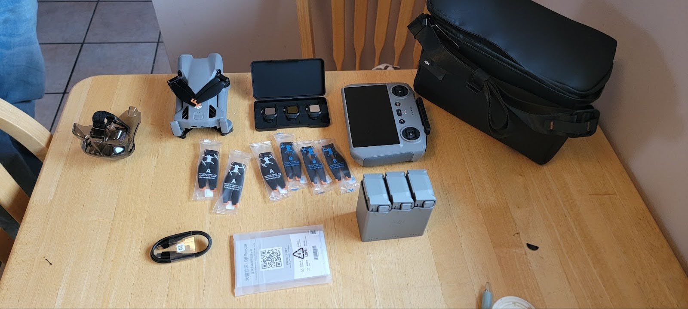

# DJI Mini 5 Pro DroneTM Setup

Guide content by Ivan Gayton.

There is also a more generic [guide for DJI drones](../dji.md) that can be referred to.

Buy a **DJI 5 Pro Fly More Combo with RC2 Controller**. Unless you know what you are doing, **do not buy the Fly More Combo Plus** (larger battery with longer flight time, but exceeds 250 g and is more strictly regulated than a <250 g drone in many countries).

You should now have:

| Item                  | Quantity / Notes          |
| --------------------- | ------------------------- |
| Mini 5 Pro drone      | 1                         |
| DJI RC2 controller    | 1                         |
| Batteries             | 3                         |
| Multi-battery charger | 1                         |
| Extra propellers      | 6 (3 A type and 3 B type) |
| Camera / gimbal guard | 1                         |
| Lens filter case      | 1                         |
| USB-C cable           | 1                         |
| Stickers and manuals  | 1 bag                     |
| Shoulder bag          | 1                         |

Remove the battery from the drone, and put it into the charger. Plug the charger into a decently powerful (up to **50 watts**, minimum **21 watts**) USB-C power source.

!!! note

    Many power banks do not work for this.

    If you want to use a power bank make sure you test it before purchasing or bringing to the field.

Plug the controller into another USB-C power source; it will want to update itself immediately and we don’t want it to run out of power in mid-update.

You will need an **SD card!**

## Set up the controller

### Turn it on and prepare for login

Turn on the controller by pressing the power button twice, once quickly and a long press immediately thereafter (you can do this while the controller is still plugged into power).

1. Choose language
2. Agree to Terms of Service
3. Choose the country
   - Choose the country you are currently in, no matter where you are going.
   - If you choose the destination country instead of where you are, the setup will fail.
4. Connect to Wi-Fi
   - It’s often a good idea to use your mobile hotspot, as you will often use this while flying.
   - However, you may not want to do the initial update over your mobile Internet if it’s a metered connection.
5. Select your time zone
   - You must choose the correct time zone for where you are or the activation will fail.
   - The controller will prompt you to check that it’s the correct time before accepting the time zone.

---

Create a **DJI account** on your phone or laptop.

!!! note

    If you create the account using **Google OAuth**, you’ll need to go into your account settings and create (change) a password.

    To do this:

    1. Choose **"verify your email"** because of course you don’t have a password yet.
    2. Now it will let you enter a **"new" (actually first) password**.

Enter the email (username) and password for your DJI account into the controller.

You should see a screen saying **Activate**.

1. Press **Activate**
2. Then press **Start**

Watch the tutorial screens or skip them if you don’t feel you need them (if you don’t know the controller button layout the tutorials may be helpful).

1. Push **Go to DJI Fly**
2. Skip the video
3. Authorize the various services (**Authorize All**)
4. Push **"Not Now"** for the DJI Product Improvement Program prompt

It will most likely now say **"New version available."**

Push **Update**.

!!! note

    Watch out if you’re on mobile Internet - this can chew up a lot of data.

It might give you a couple of tutorial screens and then again offer an update in the upper right corner of the screen.

Push **Download**.

If you agreed to the first update, after a while a dialog will appear saying the new version of **DJI Fly** is ready.

Push **Install Now**.

You’ll see some waiting dialogs, and at some point you’ll see a welcome screen with **Connect to Aircraft**.

You’re probably done.

---

## Set up the Drone

Put in a fully charged battery and turn the drone on. (I usually unfold the prop arms, though I don’t actually know if this is necessary).

Turn on the drone the same way you turn on the controller (**short press then long press** on the power button).

The controller should connect to the drone automatically as soon as they are both powered up in the same area.

The controller will then display an **"Activate DJI Device"** dialogue.

Press **Agree**.

!!! note

    If your drone and controller are not already paired for some reason, you can pair them.

    This DJI manual contains the necessary information to do so.

    However, this should normally **not** be necessary because the controller and drone in a new box from the supplier should already be paired.

    If they don’t seem to be paired it’s worth checking that you have the correct drone and controller before attempting pairing procedures.

It should say **"Activation Complete"** or something similar.

If you are prompted about **DJI Care Refresh warranty**, push **Skip**, then **Confirm**.

Most likely it will now ask you to **update the firmware of the drone**.

Push **Update**.

!!! note

    Again watch out for mobile Internet - this could be several GB of data.

At the end of this it may again suggest **"New version available."**

Push **Update** again.

The drone might have turned itself off - turn it back on.

The **"Connect to aircraft"** button will probably activate automatically as the controller reconnects.

Once the connection is successful, you will see whatever the drone camera is pointed at on the controller screen.

That is a strong hint that the connection is working properly.

You’re probably ready for a flight now.

## First flight and waypoint folder creation

You should probably fly the drone now anyway to make sure it’s working.

Perhaps obviously, you should **not do this if you have no idea what you are doing and don’t have someone to help you**.

If you have no drone experience whatsoever, please try to find someone who does to help you.

At least watch some **YouTube videos** or something.

### Start pre-flight check

1. Put joysticks on
2. Start tutorial
3. Push the **map icon in the lower left twice** to see the map screen
4. It should show your location
   - Two icons: one for the drone and one for the controller
5. Fly and take **two waypoints**

## Now let’s set some configuration for DroneTM mapping

Push the **3-dot menu button**.

### In Safety

- Set **Manual Obstacle Avoidance** to **Bypass**
- Set **Auto RTH Altitude** to **120**
- Set **Max Altitude** to **500**
- You could leave **Max Distance** at **No Limit**, but I prefer **5000 m**

### In Control

Probably don’t do anything.

### In Camera

- Confirm that the **Aspect Ratio** is **4:3**
- Confirm that the **Resolution** is **12MP**
- Set the **Storage** to **SD Card**
